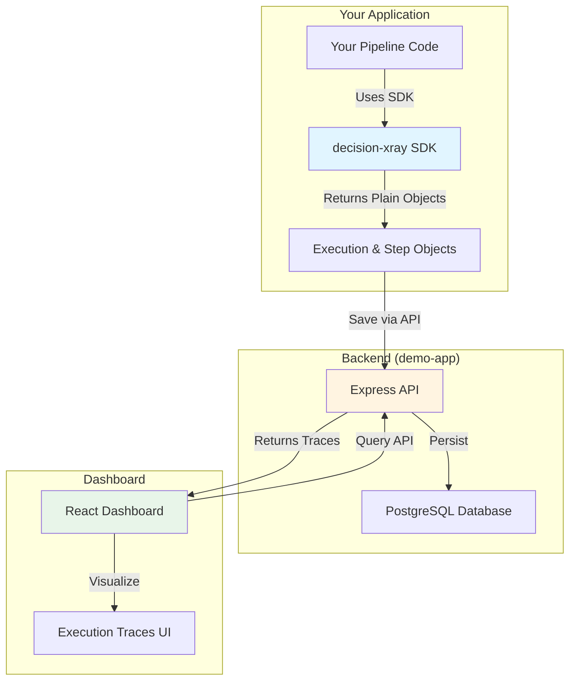

# Decision X-Ray

A debugging system for multi-step decision pipelines. When your algorithm picks the wrong output, X-Ray shows you exactly why at each step.

## The Problem

You have a pipeline: LLM generates keywords → search API returns candidates → filters narrow down → ranking selects winner. When the final output is wrong, traditional logs tell you what happened but not why. Which filter was too strict? Why was this candidate rejected? You're left reverse-engineering the entire pipeline.

## The Solution

Decision X-Ray captures the reasoning at every step:
- Why each candidate passed or failed each filter
- Actual vs expected values for debugging
- Complete decision trail you can query and visualize

## Structure

```
├── decision-xray/          # Core SDK (npm package)
├── demo-app/               # Backend API with mock workflow
└── dashboard/              # React dashboard to visualize traces
```

## Setup

**1. Build the SDK**
```bash
cd decision-xray
npm install && npm run build
```

**2. Set up database**
- Create a PostgreSQL database (we use Supabase for the demo)
- Run `demo-app/src/db/schema.sql` in your database
- Configure connection in `demo-app/src/config/local.ts`

**3. Run backend**
```bash
cd demo-app
pnpm install
pnpm dev
```

**4. Run dashboard**
```bash
cd dashboard
pnpm install
pnpm dev
```

Dashboard: `http://localhost:5173`  
Backend: `http://localhost:3000`

## Architecture



## Approach

Traditional logging tells you "12 candidates passed filters" but not why the other 38 failed. When debugging, you need specifics: which filter rejected this candidate? What was the actual value vs what was expected?

**Capture the "Why"**

Instead of just pass/fail counts, we record why each decision was made. Every filter evaluation includes actual vs expected values: "$8.99 is below minimum $14.99". Now you can see exactly what went wrong and adjust thresholds.

**Keep the SDK Simple**

The SDK is just functions that return plain JavaScript objects. Zero dependencies, no HTTP calls, no database logic. You call `recordStep()` with inputs/outputs/reasoning, and it gives you back an object. What you do with that object (save to DB, send to API, write to file) is up to you.

This means:
- Works in any environment (Node.js, browser, edge functions)
- Easy to test (no mocking databases or HTTP)
- No framework lock-in

**Store Flexible Data**

Pipelines vary wildly. Some have 3 steps with 10 candidates, others have 20 steps with 10,000 candidates. We use JSONB to store variable structures without schema migrations, while still querying efficiently on common fields (execution ID, status, date).

**Visual Debugging**

The dashboard shows execution → steps → evaluations → filters. Click to expand and drill down. Matches how you debug: start broad, narrow to specifics.

**Demo**

The demo app runs a 4-step competitor selection workflow with mock data. Each step records detailed evaluations. The dashboard visualizes the complete trace so you can see why the final product was selected.

**Future: Hosted Service**

The architecture supports a Sentry-like model. Right now you handle persistence. In the future, you'd initialize the SDK with `initXRay({ apiKey })` and it would auto-send traces to our hosted platform. The demo already shows this working end-to-end.

## Tech Stack

- **TypeScript**: Catches bugs at compile time, gives users autocomplete. Compiles to plain JavaScript.
- **Node.js + Express**: Good for async database calls, easy to swap for other frameworks.
- **PostgreSQL + JSONB**: Reliable database with flexible JSON storage for variable data structures.
- **React + Vite**: Component model works well for nested trace visualization. Fast builds.
- **Tailwind CSS**: Utility classes keep styling consistent without writing custom CSS.

## Deployment

- **SDK**: Published as npm package for distribution https://www.npmjs.com/package/decision-xray
- **Database**: Supabase (managed PostgreSQL with built-in API)
- **Backend**: Railway (containerized Node.js deployment)
- **Dashboard**: Cloudflare Pages (static site hosting)

## Known Limitations

- Mock data only (no real LLM or API calls)
- Single workflow demo (competitor selection)
- No authentication
- No pagination on API responses

## Future Improvements

- **Hosted platform**: Add `initXRay({ apiKey })` to SDK so it auto-sends traces to our hosted service (like Sentry) - users create an account, get API key, initialize SDK, and traces appear in our dashboard automatically
- Real-time execution streaming
- Execution comparison (side-by-side)
- Filter effectiveness analytics
- Export traces to JSON/CSV
- More workflow examples
